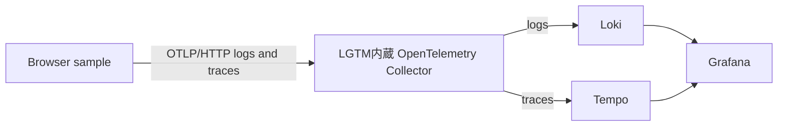

# OpenTelemetry Browser with tracing sample

ブラウザ計装が生成したイベントログとFetch/XHRトレースを、OpenTelemetry Collector経由でLoki・Tempoへ送り、Grafanaで確認するサンプルです。

ベースはOpenTelemetry Browser本家の [`examples/with-tracing`](https://github.com/open-telemetry/opentelemetry-browser/tree/main/examples/with-tracing) です。本家はテレメトリをブラウザコンソールへ出力するところまでなので、このディレクトリではローカルのGrafana LGTMへ送信・保存・検索できるように拡張しています。



## 本家サンプルとの差分

### スタンドアロン化

本家サンプルはOpenTelemetry Browserのmonorepo内で動かす前提です。このディレクトリだけでインストール・ビルドできるように、次を変更しました。

- `@opentelemetry/browser-instrumentation` と `@opentelemetry/browser-sdk` のmonorepo内相対参照を、npm公開パッケージへ変更
- `vite` と `typescript` をdevDependenciesへ追加
- monorepoルートを継承していたTypeScript設定を、スタンドアロンの設定へ変更
- 現在のNode.js 20環境で動作するVite 6を使用
- トップレベル`await`を初期化関数内へ移動し、Viteの標準ビルドターゲットでビルド可能に変更

### OTLPエクスポートの追加

本家は `ConsoleLogRecordExporter` と `ConsoleSpanExporter` のみを使用します。このサンプルではコンソール出力を残したまま、次のエクスポーターを追加しました。

- `OTLPLogExporter`: `http://localhost:4318/v1/logs`
- `OTLPTraceExporter`: `http://localhost:4318/v1/traces`
- サービス名: `otel-browser-with-tracing`

OTLP送信リクエスト自体がFetch/XHRスパンとして再計装されないように、`http://localhost:4318/` を `ignoreUrls` に指定しています。これがないと、エクスポートによって新しいテレメトリが生成される再帰が発生します。

Fetch/XHRのテスト先とボタンハンドラーは本家と同じ `https://httpbin.org/get` です。`propagateTraceHeaderCorsUrls` は設定していないため、別オリジンのテスト先へ `traceparent` は付与しませんが、ブラウザ側の `HTTP GET` スパンは生成されます。

### ローカル観測基盤の追加

本家にはCollectorやバックエンドが含まれないため、`grafana/otel-lgtm` を追加しました。このイメージはGrafana、Loki、Tempoに加えてOpenTelemetry Collectorも内蔵しているため、Collectorを別コンテナでは起動していません。

- `grafana/otel-lgtm` 内蔵OpenTelemetry Collector
  - ブラウザからのOTLP/HTTPをポート4318で受信
  - イメージ標準設定のCORS（`http://*`）を使用
  - Logsパイプラインを同一コンテナ内のLokiへ転送
  - Tracesパイプラインを同一コンテナ内のTempoへ転送
  - イメージ標準設定のBatch Processorで送信をバッチ化
- `grafana/otel-lgtm`
  - Collector、Grafana、Loki、Tempoを1コンテナでまとめて起動
  - Grafanaをポート3000、OTLP/HTTPをポート4318で公開
  - LokiとTempoはコンテナ内でのみ利用し、ホストには直接公開しない
  - `lgtm-data` Dockerボリュームへデータを保存
- Docker Composeの起動・終了用npmスクリプト
  - `npm run observability:up`
  - `npm run observability:down`

## 起動

Dockerを起動してから、次を実行します。

```sh
npm install
npm run observability:up
npm run dev
```

ブラウザで `http://localhost:5173` を開き、FetchまたはXHRボタンをクリックします。

- ページ遷移、Web Vitals、ユーザー操作はログとして `http://localhost:4318/v1/logs` へ送信されます。
- Fetch/XHRはスパンとして `http://localhost:4318/v1/traces` へ送信されます。

## Grafanaで確認

1. `http://localhost:3000` を開きます。
2. `admin` / `admin` でログインします（初回にパスワード変更を求められた場合はスキップできます）。
3. **Explore** を開いてデータソースに **Loki** を選択します。
4. Label filtersで `service_name = otel-browser-with-tracing` を指定して **Run query** を押します。

データが見つからない場合は、時間範囲を **Last 15 minutes** にしてページを再読み込みしてください。

## Tempoでトレースを確認

1. Grafanaの **Explore** を開いてデータソースに **Tempo** を選択します。
2. Query typeに **Search** を選択します。
3. Service Nameに `otel-browser-with-tracing` を指定します。
4. **Run query** を押し、`HTTP GET` スパンを開きます。

TraceQLで直接検索する場合は、次を使用できます。

```traceql
{resource.service.name="otel-browser-with-tracing"}
```

## ログとトレースの相関

本家のセッションプロセッサにより、ログとスパンの両方へ同じ `session.id` が付与されます。実際にLokiとTempoへ保存されたデータで、同じセッションIDが付いていることを確認しています。

Lokiでは、Tempoのスパンに表示された `session.id` を使って同一ブラウザセッションのログを検索できます。

```logql
{service_name="otel-browser-with-tracing"} | session_id="<Tempoで確認したsession.id>"
```

ただし、現状のイベントログとFetch/XHRスパンは `trace_id` では直接紐付きません。Navigation Timing、Web Vitals、ユーザー操作などのイベントログはFetch/XHRスパンのアクティブコンテキスト外で生成されるため、ログに `trace_id` と `span_id` が付きません。

Grafana LGTMにはTempoからLokiを開く **Explore the logs for this in split view** が設定されていますが、標準クエリは `trace_id` を使用するため、このサンプルでは結果が0件になります。確認結果は次の通りです。

| 相関方法     | 結果                                     |
| ------------ | ---------------------------------------- |
| `session.id` | 同一セッションのログとスパンを相関可能   |
| `trace_id`   | イベントログに存在しないため直接相関不可 |

GrafanaのTrace to logsリンクで直接相関させる場合は、アプリケーションスパンを開始し、そのアクティブコンテキスト内でログを発行して `trace_id` と `span_id` をログへ付与する追加実装が必要です。この追加実装は、本家サンプルとの差分を最小限にするため現時点では入れていません。

## 終了

```sh
npm run observability:down
```

`lgtm-data` ボリュームを含めて削除する場合は `docker compose down -v` を実行します。
